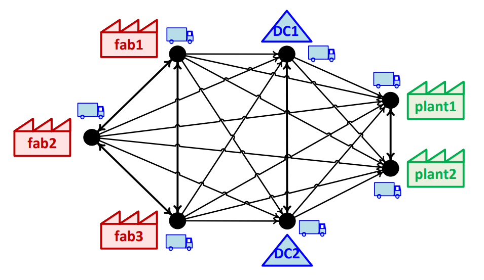
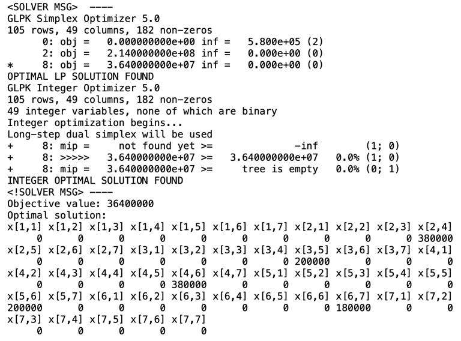

## Task at hand:

DXP is a manufacturer of various types of semiconductor chips, including telecom, automotive, and healthcare. The automotive business unit of the company is releasing their state-of-the-art advanced driver-assistance system chipset developed in the 3-nm CMOS technology. Besides producing at their own fab (fab1), they have outsourced the chipset production to two pure-play foundries (fab2 and fab3). The chipsets can be shipped to two plants of a car manufacturing customer (plant1 and plant2) either directly from the fabs or through two distribution centers (DC1 and DC2). The chipsets can move among fabs, between DCs, between plants, and from fabs (through DCs) to plants.



The three fabs can produce at most 400K, 600K, and 200K packs of chipset, respectively (K=1000). The two plants demand exactly 400K and 180K packs of chipsets, respectively. The cost of shipment via each possible link is indicated in the table below. Note that due to administrative or economic reasons, the cost of bidirectional links are asymmetric. Because of reliability measures, at most 400K packs of chipset can be sent via any shipment link.

Table 1. Per pack cost of shipment via the links (in €)
| from\to | fab1 | fab2 | fab3 | DC1 | DC2 | plant1 | plant2 |
|---------|------|------|------|-----|-----|--------|--------|
| fab1    |      | 100  | 60   | 100 | 100 | 400    | 400    |
| fab2    | 180  |      | 180  | 20  | 20  | 160    | 300    |
| fab3    | 8    | 160  |      | 20  | 10  | 200    | 240    |
| DC1     |      |      |      |     | 24  | 40     | 240    |
| DC2     |      |      |      | 16  |     | 40     | 240    |
| plant1  |      |      |      |     |     |        | 20     |
| plant2  |      |      |      |     |     | 140    |        |

Formulate and solve a mathematical program (MILP) to answer the following questions: 
1. How many chipset packs should be sent via each link (and in which direction if applicable) 
to minimize the total shipment cost, while fulfilling demand of both plants? 
2. How much is the minimum total shipment cost?

## Formulation:
### Decision Variables

$x_{ij}$ = number of items shipped from node $i$ to node $j$

where $i, j \in \{(1, 2, 3, 4, 5, 6, 7\})$ represent the following nodes:
- $1$: fab1
- $2$: fab2
- $3$ : fab3
- $4$ : DC1
- $5$ : DC2
- $6$ : plant1
- $7$ : plant2

### Objective Function

The objective is to minimize the total cost, which is represented as:
```math
Z = \sum_{i} \sum_{j} \left(\text{cost matrix}_{ij} \cdot x_{ij}\right)
```
where $\text{cost matrix}_{ij}$ represents the cost of shipping one item from node $i$ to node $j$.

### Subject to
#### 1. Production Capacity Constraints
These constraints ensure that the fabs do not produce more items than their capacity:

$\sum_{j} x_{1j} - \sum_{i} x_{i1} \leq 400000$

$\sum_{j} x_{2j} - \sum_{i} x_{i2} \leq 600000$

$\sum_{j} x_{3j} - \sum_{i} x_{i3} \leq 200000$

#### 2. Distribution Centers Constraints

These constraints ensure that the number of items entering and leaving the distribution centers are equal:

$\sum_{j} x_{4j} = \sum_{i} x_{i4}$

$\sum_{j} x_{5j} = \sum_{i} x_{i5}$

#### 3. Plant Demand Constraints

These constraints ensure that plants receive the exact number of items they demand:

$\sum_{j} x_{6j} - \sum_{i} x_{i6} = -400000$

$\sum_{j} x_{7j} - \sum_{i} x_{i7} = -180000$

#### 4. Link Capacity Constraints

These constraints ensure that the number of items shipped between any pair of nodes does not exceed the maximum capacity:

$x_{ij} \leq 400000$

#### 5. Non-Negativity Constraints

These constraints ensure that the number of items shipped between nodes is always non-negative:

$x_{ij} \geq 0$

## Solution

[Link to R code file](https://github.com/nickpostovoi/projects/blob/af01bde130ab8913ad49843b041e673f1802b5f4/Mixed%20Integer%20Linear%20Programming/Chipset%20Logistics/cl_code.r)



## Interpretation

The solution minimizes the total cost to 36400000 while satisfying both plants' demands. Fab 1 will not produce or ship any chipsets, while fab 2 will produce 380000 chipsets and send them to DC1, and fab3 will produce 200000 items and send them to DC2. Distribution centres (DC1 and DC2) will then ship 380000 and 200000 chipsets respectively to plant 1. Plant 1 will fulfil its demand of 400000 chipsets and send the remaining 180000 chipsets to plant 2 to meet its requirements. 