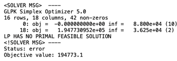
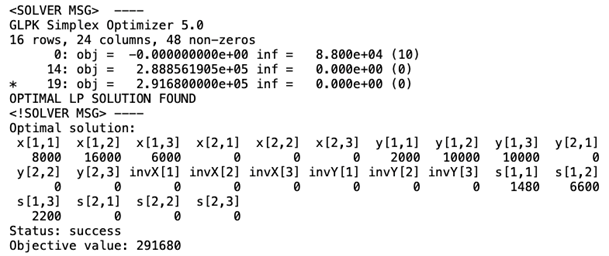
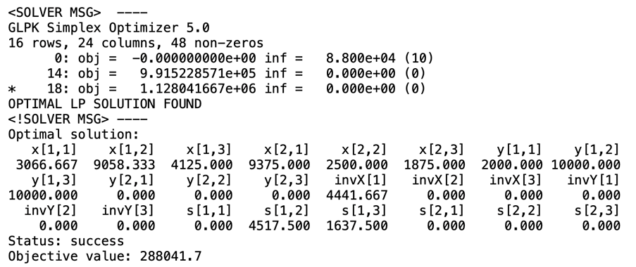

## Task at hand:

DG-Lynx is a manufacturer of “ocean Internet cables” (submarine communication cables). For the production plan of the next quarter, the company is considering two types of cable. The manufacturing department is required to produce the following amounts by the end of each month of the plan (demand table below): 

Table 1. Demanded cable lengths (in kilometers)
| Date | Type-A | Type-B |
|------|-------|-------|
| Jan 31 | 8,000 | 2,000 |
| Feb 28 | 16,000 | 10,000 |
| Mar 31 | 6,000 | 10,000 |
| Total | 30,000 | 22,000 |

Table 2. Plant availability (hours)
| Date | Plant-1 | Plant-2 |
|------|---------|---------|
| Jan | 1,400 | 3,000 |
| Feb | 600 | 800 |
| Mar | 2,000 | 600 |

Note that the entire demand must be fulfilled, and the cables are shipped to customers at the end of the month based on the above demand table. The excess production of the month enters inventory at the end of that month. That is, during the month while the cables are being produced, no inventory cost incurs. Two plants can be allocated for the production of these orders. The number of hours available and the time it takes to produce one kilometer of each type of cable are given in the plant availability table above and the production rate table below, respectively: 

Table 3. Plant production rates (hours per kilometer)
| Date   | Plant-1 | Plant-2 |
|--------|---------|---------|
| Type-A | 0.30    | 0.32    |
| Type-B | 0.24    | 0.28    |

The costs involved in the plan are as follows (𐓌 is a fictitious currency used in this 
problem): 
- A kilometer of either cable costs 𐓌10.00 per hour to produce at either plant. 
- There is a holding (inventory) cost of 𐓌0.20 per kilometer of either cable per month. 
- The raw material cost is 𐓌6.20 per kilometer of Type-A and 𐓌7.80 per kilometer of Type-B. 
- The packing cost is 𐓌0.46 per kilometer of either type.

The selling price is 𐓌14.00 per kilometer of Type-A and 𐓌18.00 per kilometer of Type-B.

Formulate and solve a mathematical program (MILP) to answer the following questions: 
1. Devise a production schedule for the maximum possible total profit (revenue minus costs), while meeting all requirements. 
2. How much is the total profit under the optimal production schedule you have devised?

Hint: There should be no inventory at the end of March, i.e., the demanded lengths of each month must be fulfilled by the end of each month, and the production in January and February may carry over inventory to the next month (on top of fulfilling the demand of the month). 

## Initial formulation
### Decision variables

- $x_{ij}$ : kilometers of Type-A cable produced in plant $i$ in month $j$
- $y_{ij}$ : kilometers of Type-B cable produced in plant $i$ in month $j$
- $invX_j$ : inventory of Type-A cable at the end of month $j$
- $invY_j$ : inventory of Type-B cable at the end of month $j$

where $i \in \{1,2\}$ (plants) and $j \in \{1,2,3\}$ (months).

### Objective function

Maximize profit:
```math
\begin{align*}
Z &= \text{Revenue} - \text{Costs} = \\
&= \text{Revenue} - \left(\text{Production Costs} + \text{Raw Material Costs} + \text{Packing Costs} + \text{Inventory Costs}\right) = \\
&= \sum_j \left(14 \cdot (x_{1j} + x_{2j}) - 10 \cdot (0.3x_{1j} + 0.32x_{2j}) - 6.2 \cdot (x_{1j} + x_{2j}) - 0.46 \cdot (x_{1j} + x_{2j}) - 0.20 \cdot \text{invX}_j\right) + \\
&\quad + \sum_j \left(18 \cdot (y_{1j} + y_{2j}) - 10 \cdot (0.24y_{1j} + 0.28y_{2j}) - 7.8 \cdot (y_{1j} + y_{2j}) - 0.46 \cdot (y_{1j} + y_{2j}) - 0.20 \cdot \text{invY}_j\right)
\end{align*}
```

### Subject to:

#### 1. Production capacity constraints:

$0.3x_{1,1} + 0.24y_{1,1} \leq 1400$ </br>
$0.3x_{1,2} + 0.24y_{1,2} \leq 600$ </br>
$0.3x_{1,3} + 0.24y_{1,3} \leq 2000$ </br>
$0.3(2x_{2,1}) + 0.28y_{2,1} \leq 3000$ </br>
$0.3(2x_{2,2}) + 0.28y_{2,2} \leq 800$ </br>
$0.3(2x_{2,3}) + 0.28y_{2,3} \leq 600$ </br>

#### 2. Monthly demand fulfilment:

$x_{1,1} + x_{2,1} \geq 8000$ </br>
$x_{1,2} + x_{2,2} + \text{inv}X_{1} \geq 16000$ </br>
$x_{1,3} + x_{2,3} + \text{inv}X_{2} \geq 6000$ </br>
$y_{1,1} + y_{2,1} \geq 2000$ </br>
$y_{1,2} + y_{2,2} + \text{inv}Y_{1} \geq 10000$ </br>
$y_{1,3} + y_{2,3} + \text{inv}Y_{2} \geq 10000$ </br>

#### 3. Inventory constraints:

$\text{inv}X_{1} = x_{1,1} + x_{2,1} - 8000$ </br>
$\text{inv}X_{2} = x_{1,2} + x_{2,2} + \text{inv}X_{1} - 16000$ </br>
$x_{1,3} + x_{2,3} + \text{inv}X_{2} = 6000$ (no inventory at the end of March) </br>
$\text{inv}Y_{1} = y_{1,1} + y_{2,1} - 2000$ </br>
$\text{inv}Y_{2} = y_{1,2} + y_{2,2} + \text{inv}Y_{1} - 10000$ </br>
$y_{1,3} + y_{2,3} + \text{inv}Y_{2} = 10000$ (no inventory at the end of March) </br>

## Solution

[Link to R code file](https://github.com/nickpostovoi/projects/blob/9c83650c2c2ef1d83c8ca33d62b87317b2343e7a/Mixed%20Integer%20Linear%20Programming/Ocean%20Internet%20Cables/oic_code.r)

### Attempt 1 Outcome: LP HAS NO PRIMAL FEASIBLE SOLUTION



To overcome this issue, it is needed to find the minimum relaxation needed for a feasible solution. It could be done by introducing slack variables into constraints. Slack variables represent the extent to which a constraint is relaxed, so their values are the smallest relaxation needed for feasibility.

### New decision variables
$s_{i,j} = \text{extra plant } i \text{ availability in month } j$

### New production capacity constraints
$0.3x_{1,1} + 0.24y_{1,1} - s_{1,1} \leq 1400$ </br>
$0.3x_{1,2} + 0.24y_{1,2} - s_{1,2} \leq 600$ </br>
$0.3x_{1,3} + 0.24y_{1,3} - s_{1,3} \leq 2000$ </br>
$0.3(2x_{2,1}) + 0.28y_{2,1} - s_{2,1} \leq 3000$ </br>
$0.3(2x_{2,2}) + 0.28y_{2,2} - s_{2,2} \leq 800$ </br>
$0.3(2x_{2,3}) + 0.28y_{2,3} - s_{2,3} \leq 600$ </br>

### Attempt 2 Outcome: Optimal solution is found, however plant 2 is idling



According to this solution, plant 2 should not be utilized for production at all, while slack variables suggest that capacities should be increased for the first plant. It is not an optimal solution, therefore, to overcome this issue it is possible to modify the objective function to encourage a more balanced utilization of both plants.

### New objective function

```math
\begin{align*}
Z &= \text{Revenue} - \text{Costs} - \text{Penalty} =\\
&= \text{Revenue} - \left(\text{Production Costs} + \text{Raw Material Costs} + \text{Packing Costs} + \text{Inventory Costs}\right) -\\
& - \alpha \sum_j \left(s_{1j} + s_{2j}\right)
\end{align*}
```
### Attempt 3 Outcome: Optimal solution is found



## Interpretation
According to the final solution, **plant 1** should produce:
- 3066.67 km of cable A and 2000 km of cable B in January.
- 9058.33 km of cable A and 10000 km of cable B in February.
- 4125 km of cable A and 10000 km of cable B in March.

**Plant 2** should produce:
- 9375 km of cable A and no cable B in January.
- 2500 km of cable A and no cable B in February.
- 1875 km of cable A and no cable B in March.

Inventory levels at the end of each month are as follows:
- **January:** 4441.67 km of cable A and no cable B.
- **February:** No inventory for cable A and cable B.
- **March:** No inventory for both cable A and cable B.

The slack variables represent the additional production capacity required at plant 1 to make the problem feasible. In this case, the slack variables indicate that it is needed to increase the production capacity of plant 1 by 4517.5 hours in February and by 1637.5 hours in March to meet the demand and achieve the optimal solution.

The total profit achieved with this production plan is 288041.70.

