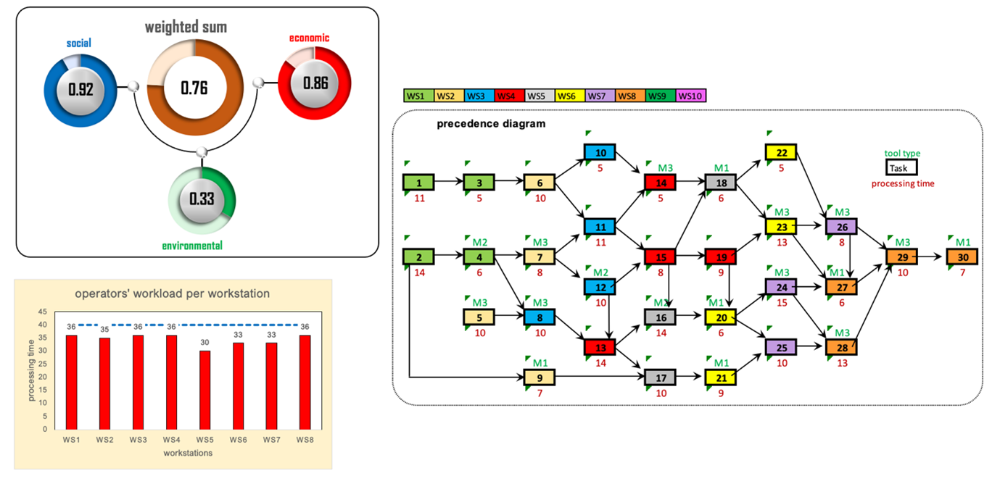
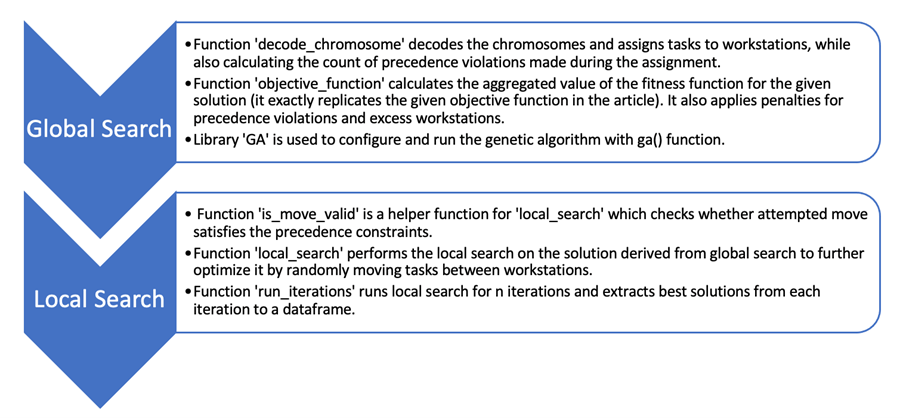
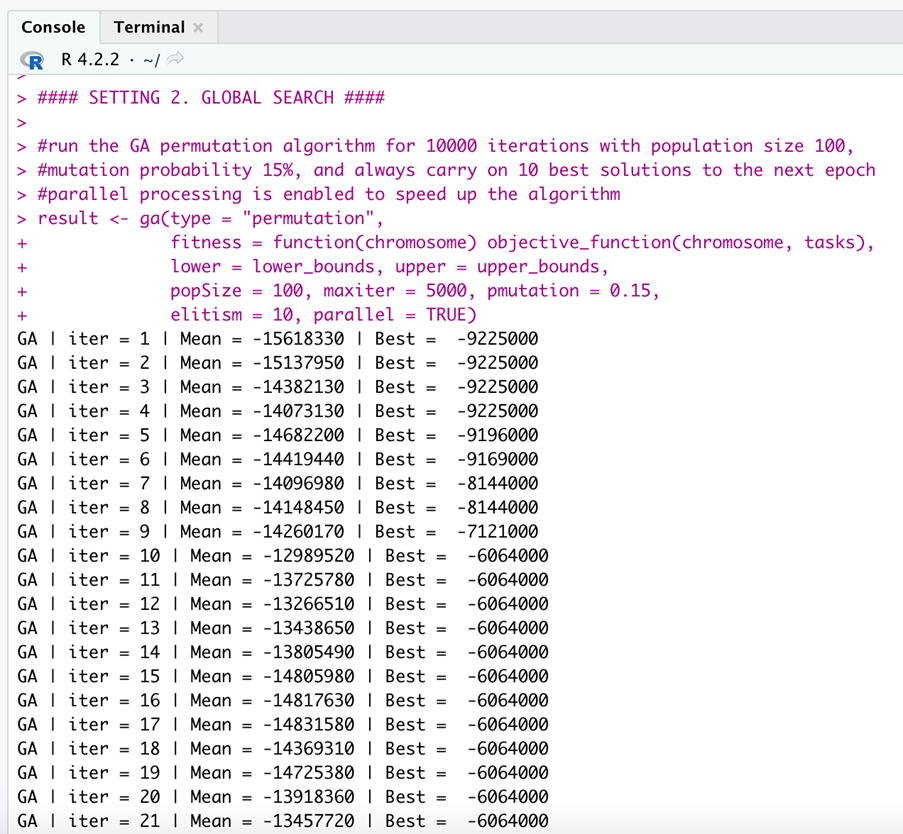
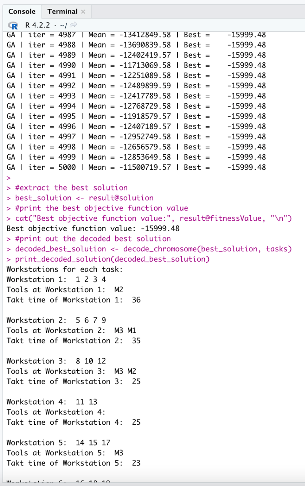
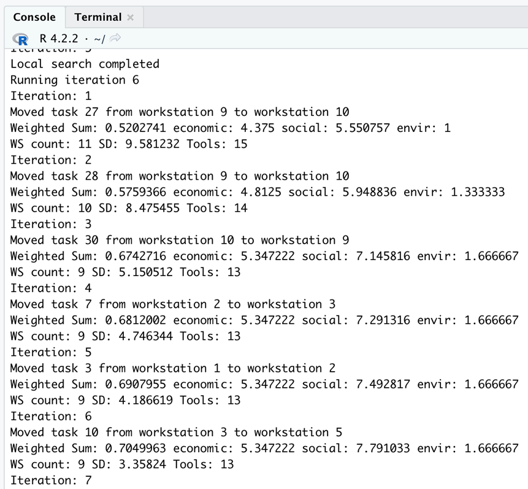

## Task at hand

A comprehensive explanation of the game is available at: [Multiobjective Line Balancing Game by Taher Ahmadi and Bo van der Rhee](https://doi.org/10.1287/ited.2022.0277)

## Proposed solution

Figure 1. Visual representation of the solution derived by the script

The developed [R script]() employs a combination of global and local search approaches to solve a given problem considering takt time, precedence constraints, task time and tool requirements.

Figure 2. General description of the solution script

The global search uses the Genetic Algorithm (GA), a heuristic inspired by natural selection and genetic recombination processes in biology. It works by iteratively generating populations of solutions (or chromosomes), selecting the ones with the best objective score, and then performing permutations to create new chromosomes that carry characteristics of their parent chromosomes. In this case, each gene in a chromosome corresponds to one of the 30 tasks, and their order represents the assignment of tasks to workstations. The global search ultimately arrives at a feasible solution that is further to be optimised by a local search. The main advantage of using GA to perform global search is that this algorithm effectively searches multimodal complex solution spaces while preserving adaptability, making it easier to adjust to a wide range of problems. The disadvantages include the algorithm's high computation cost, especially if the solution space is ample or the objective function is complex. Therefore, it is not suitable for problems that require real-time optimisation. However, it supports parallel multi-threaded execution, which can help to speed up the computations. Nevertheless, the main disadvantage is that this approach fails to guarantee convergence to the global optimum (the best possible solution available). Therefore, it is only sometimes the most effective method for specific problems. 

Figure 3. Example of a global search console output

Figure 4. Example of a feasible solution generated by global search

The developed implementation of local search starts with a feasible solution extracted from the global search and attempts to improve the solution iteratively by randomly moving tasks from one workstation to another, ensuring all the constraints are being met. For each job move, it checks if moving it to another workstation results in a better solution or not by computing the objective function. No move could be made to improve the answer if it terminates itself. That process is executed multiple times to explore the solution space better and increase the probability of finding a better solution. Ultimately, the best solution is being returned with information about objective function value, task assignment to workstations and tools used at each workstation. 

Figure 5. Example of a local search console output

The limitation of the current implementation of stochastic search is that it is implemented in a "top-to-bottom" manner, starting with many workstations and removing them during optimisation. The drawback of that approach is that it becomes hard for the search to converge to the least possible workstations in a reasonable time frame. The workaround would be implementing the search differently; starting the initial solution with the least likely number of workstations and optimising this solution would likely yield better results.
