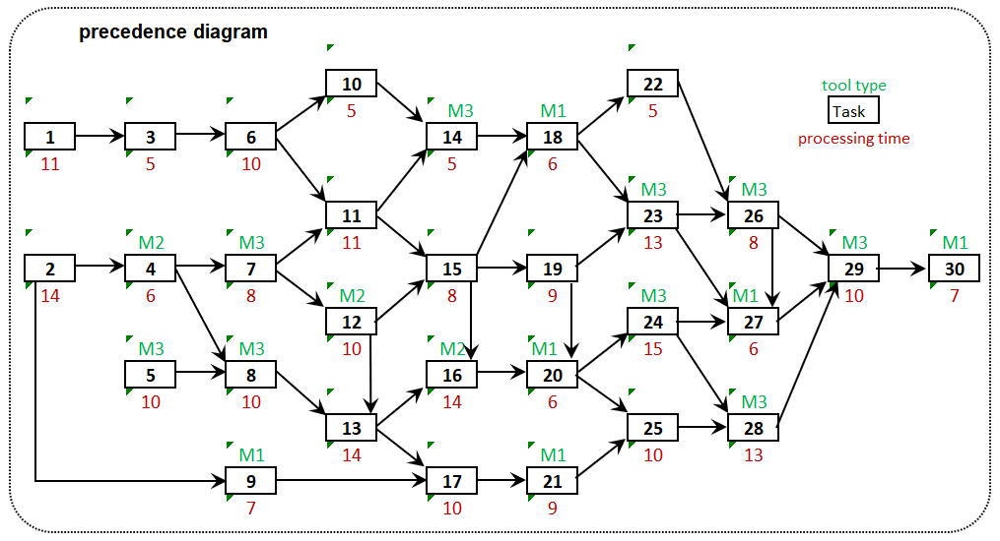
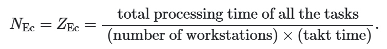
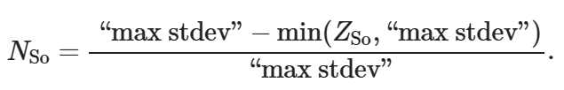
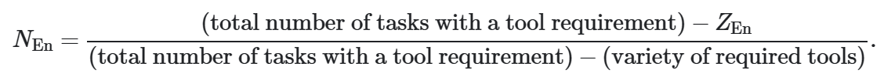
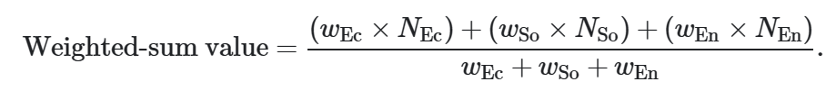
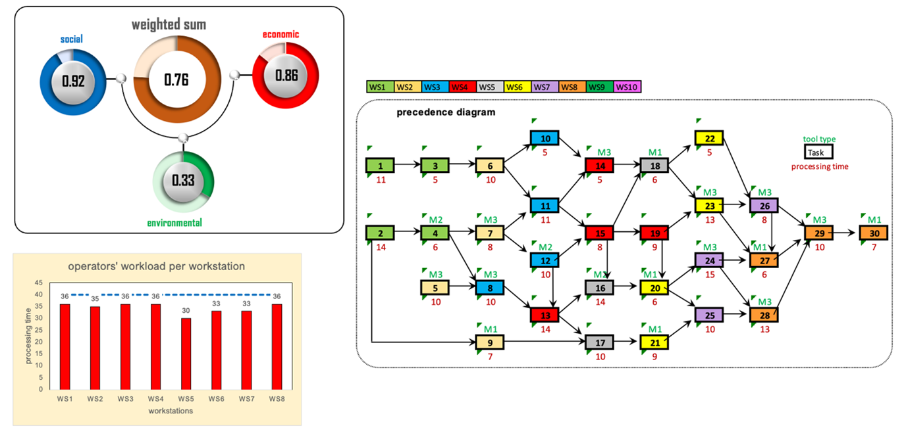
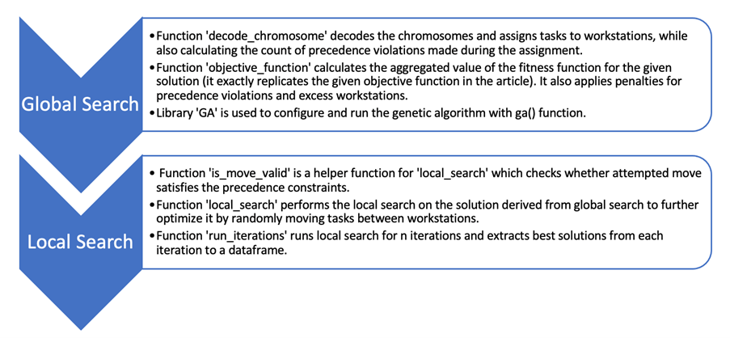
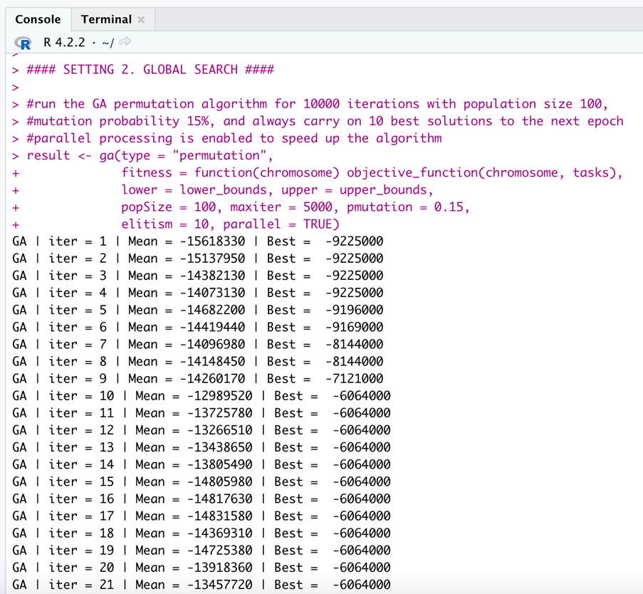
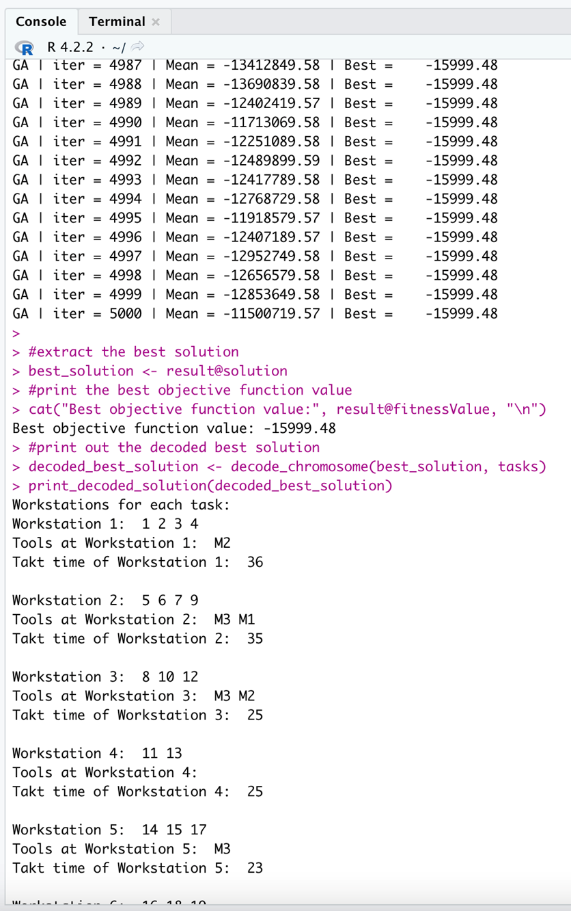
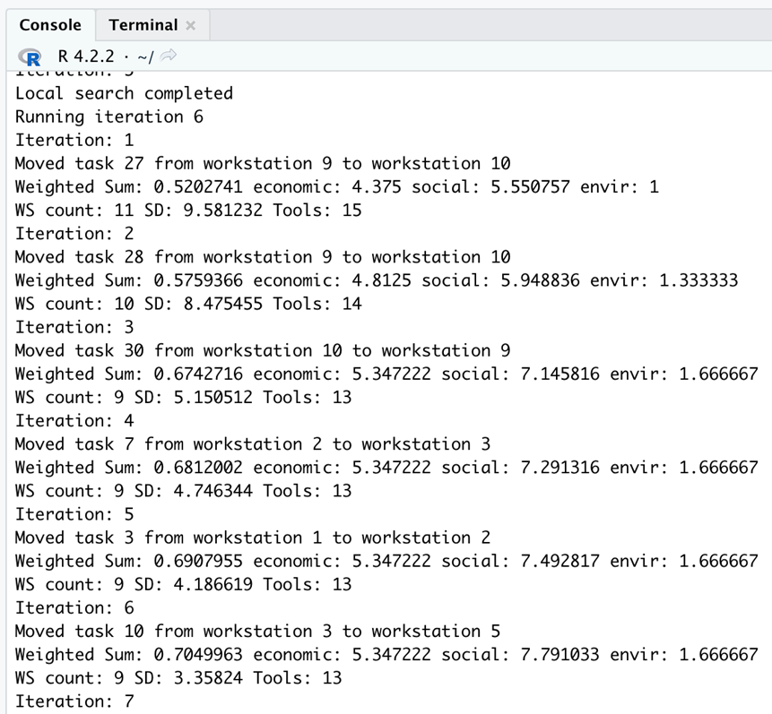

## Task at hand

**Note:** A comprehensive explanation of the game is available at: [Multiobjective Line Balancing Game by Taher Ahmadi and Bo van der Rhee](https://doi.org/10.1287/ited.2022.0277)

Suppose a manufacturer plans to design an assembly line (i.e., a sequence of working areas known as workstations). Based on the information received from the product design department, for this product, 30 tasks (i.e., elements of work that have to be performed to assemble the product) should be performed according to the precedence diagram presented in Figure 1. The precedence diagram containing nodes and arrows that partially specify the sequence of tasks that has to be considered to be able to perform tasks.

Figure 1. A 10-Task Precedence Diagram Containing Tool Type and Processing Time per Task 

Performing each task requires some time, which is called task processing time. Also, each task might need a specific type of cordless power tool that is necessary to perform the corresponding task in the assembly line. The processing time and tool requirement per task are given below and above the corresponding task box, respectively, in Figure 1. There are three different types of cordless power tools labeled M1, M2, and M3.

Every 40 seconds one unit of the product should be assembled to meet the production plan, and this 40-second time interval is called takt time. 

To balance the line, the tasks need to be assigned to workstations such that the precedence restrictions among tasks are not violated and the workload given to each workstation does not surpass the takt time.

The effectiveness of a balancing solution is evaluated based on the TBL framework by taking the economic, social, and environmental aspects into account. 

1. The economic objective can be achieved by minimizing the number of workstations (i.e., a fewer number of workstations is translated into less labor and space costs).

2. The social objective can be achieved by maximizing operator workload smoothness (i.e., a higher operator workload smoothness is translated into more fairness and less ergonomic risks).

3. The environmental objective can be achieved by minimizing the total number of cordless power tools required for the entire assembly line (i.e., fewer tools are translated into less hazardous materials, such as cadmium and mercury used in the batteries that can contaminate soil and groundwater).

The weighted-sum value corresponding to a balance decision is calculated by incorporating the decision maker’s preferences (weights):

## Proposed solution

The developed [R script](https://github.com/nickpostovoi/projects/blob/e9464484133b3fc1903e03bcec2c625b76ff3b87/Multi-Objective%20Production-Line%20Balancing/molb_code.R) employs a combination of global and local search approaches to solve a given problem considering takt time, precedence constraints, task time and tool requirements.

Figure 2. Visual representation of the solution derived by the script 

Figure 3. General description of the solution script  

The global search uses the Genetic Algorithm (GA), a heuristic inspired by natural selection and genetic recombination processes in biology. It works by iteratively generating populations of solutions (or chromosomes), selecting the ones with the best objective score, and then performing permutations to create new chromosomes that carry characteristics of their parent chromosomes. In this case, each gene in a chromosome corresponds to one of the 30 tasks, and their order represents the assignment of tasks to workstations. The global search ultimately arrives at a feasible solution that is further to be optimised by a local search. The main advantage of using GA to perform global search is that this algorithm effectively searches multimodal complex solution spaces while preserving adaptability, making it easier to adjust to a wide range of problems. The disadvantages include the algorithm's high computation cost, especially if the solution space is ample or the objective function is complex. Therefore, it is not suitable for problems that require real-time optimisation. However, it supports parallel multi-threaded execution, which can help to speed up the computations. Nevertheless, the main disadvantage is that this approach fails to guarantee convergence to the global optimum (the best possible solution available). Therefore, it is only sometimes the most effective method for specific problems. 

Figure 4. Example of a global search console output 

Figure 5. Example of a feasible solution generated by global search 

The developed implementation of local search starts with a feasible solution extracted from the global search and attempts to improve the solution iteratively by randomly moving tasks from one workstation to another, ensuring all the constraints are being met. For each job move, it checks if moving it to another workstation results in a better solution or not by computing the objective function. No move could be made to improve the answer if it terminates itself. That process is executed multiple times to explore the solution space better and increase the probability of finding a better solution. Ultimately, the best solution is being returned with information about objective function value, task assignment to workstations and tools used at each workstation. 

Figure 6. Example of a local search console output 

The limitation of the current implementation of stochastic search is that it is implemented in a "top-to-bottom" manner, starting with many workstations and removing them during optimisation. The drawback of that approach is that it becomes hard for the search to converge to the least possible workstations in a reasonable time frame. The workaround would be implementing the search differently; starting the initial solution with the least likely number of workstations and optimising this solution would likely yield better results.

## Appendix

**Solution:**

$workstations[[1]]  
[1] 2 1 4 3

$workstations[[2]]  
[1] 7 5 6 9

$workstations[[3]]  
[1] 11 12  8 10

$workstations[[4]]  
[1] 14 15 13 19

$workstations[[5]]  
[1] 17 18 16

$workstations[[6]]  
[1] 20 21 22 23

$workstations[[7]]  
[1] 24 26 25

$workstations[[8]]  
[1] 28 27 29 30

$workstation_load  
[1] 36 35 36 36 30 33 33 36

$workstation_tools[[1]]  
[1]    "M2"

$workstation_tools[[2]]  
[1] "M3"    "M1"

$workstation_tools[[3]]  
[1]    "M2" "M3"

$workstation_tools[[4]]  
[1] "M3"   

$workstation_tools[[5]]  
[1]    "M1" "M2"

$workstation_tools[[6]]  
[1] "M1"    "M3"

$workstation_tools[[7]]  
[1] "M3"   

$workstation_tools[[8]]  
[1] "M3" "M1"
