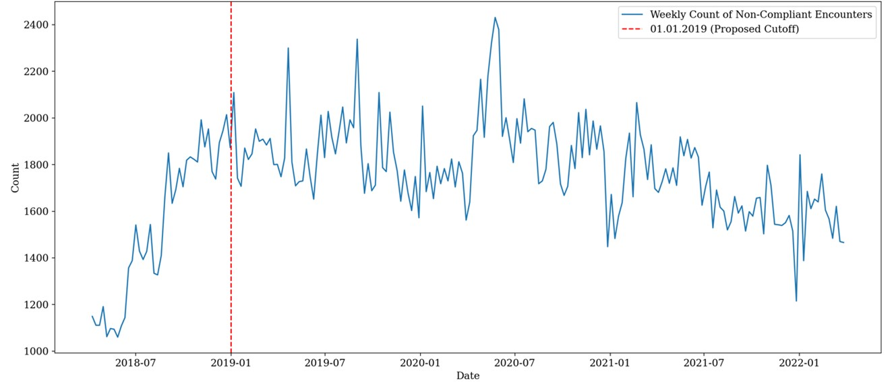
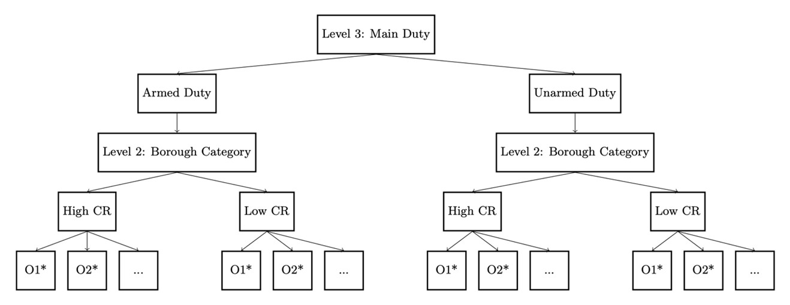
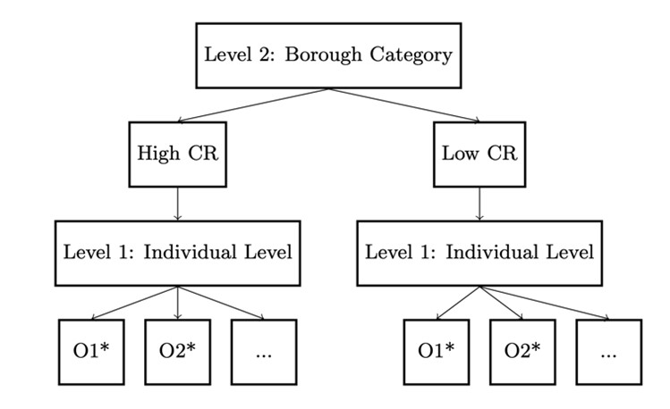
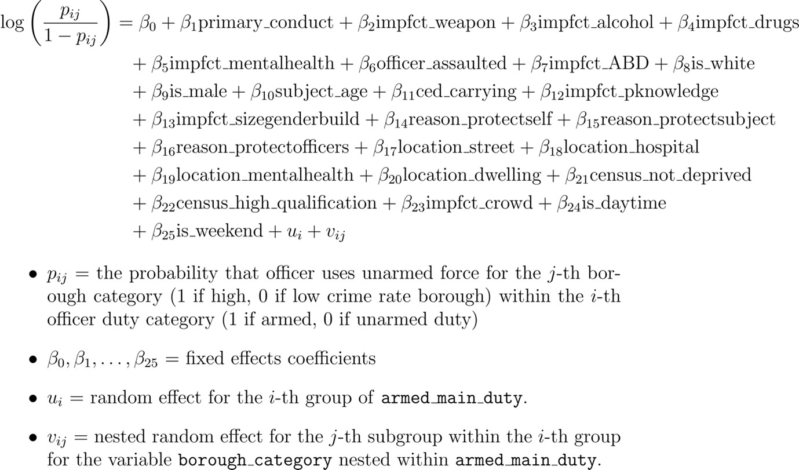
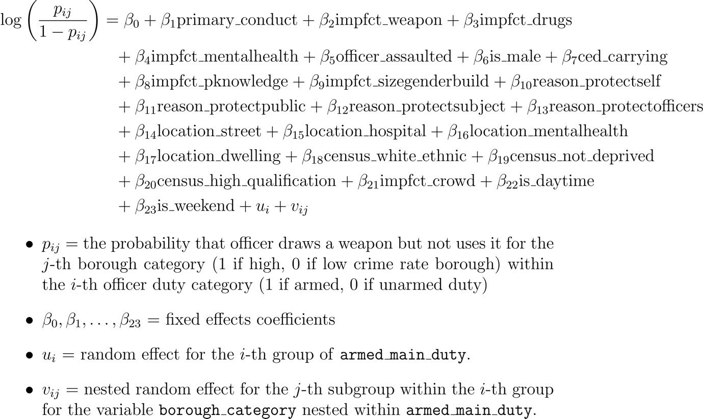
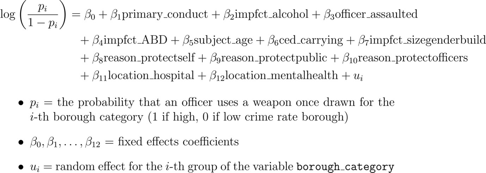
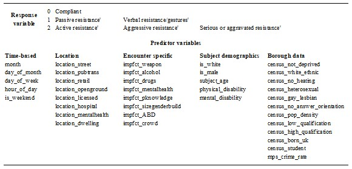

## Introduction

This project aims to provide an up-to-date, evidence-based understanding of factors and patterns related to the use of force by the Metropolitan Police Force (MPS) in London so it can be further used to shape the related policies. The study aims to answer the following research questions:

- Which characteristics reported by the MPS as a part of the use of force self-report forms are statistically significant in explaining the odds of using unarmed force, drawing but not using a weapon, and using a weapon once drawn? What are the directions and magnitudes of these relationships?
- Is it possible to predict, with sufficient accuracy, whether the subject will be compliant, passively/verbally resistant, or aggressively resistant before an encounter happens using the 'foreknowledge'?
- Are there any seasonal patterns in the occurrence of non-compliant encounters? Can time-series models be used to predict their rates with sufficient accuracy?

## Data Source

The project relies on the [use-of-force forms data](https://data.london.gov.uk/dataset/use-of-force) integrated with the [street crime data](https://data.police.uk/data/) publicly shared by MPS, and the [Official Census 2021 from Office for National Statistics](https://www.ons.gov.uk/census). All the police forces in the UK have been compelled to keep records of every time they use force (including verbal or compliant handcuffing) since 2017. From 2021, this data has been categorised as 'Official Statistics' due to meeting the standards for data collection and quality; however, it was published before as 'Experimental Statistics'. An integration with Census street crime data is performed to provide a broader perspective by including social/community-level characteristics when explaining the decision-making behind the use of force.

**Limitations:** The issue with official police records is that the party in charge reports the specifics of the incident, possibly injecting bias to justify the force. Furthermore, the recorded occurrences do not indicate how many unique people were subjected to police action. Home Office also mentions a COVID-19 pandemic effect on the 2020-2021 reporting period, which is important for the third research question that uses it for training purposes.

The dataset includes 679,173 cases of force usage recorded from April 2017; however, this study only utilises the most reliable 'Official Statistics' labelled slice for training purposes and the year prior for evaluation purposes to answer the first two research questions. Nevertheless, a longer data sequence is included for the third research question to allow the model to learn the long-term patterns. The cut-off point at the beginning of 2019 is used since the prior data indicate the lack of coverage.

Figure. Lack of coverage prior to 2019  

**Filtering:** Encounters where the officer is off duty or executing a custody duty were removed to focus on regular policing duties since decision-making patterns might differ substantially. By excluding instances with the escaped subject, it is possible to avoid potential biases or anomalies in situations where officers have not directly influenced the outcome. Observations where the use of force occurred in a police vehicle, custody, ambulances, or sports/events stadia were also removed to focus on the decision-making patterns in more typical policing scenarios.

## Inference Modelling

Although it was initially planned to use a multi-level linear regression to model the severity of a force used, it was later decided to **separate the problem into three multi-level logistic regression problems**, modelling whether a specific type of force was used, since factors could have varying statistical significance and magnitude of influence depending on the type of force is being and context. This approach provides deeper insights into patterns of force, which will be discussed in the following chapters.

The **three-level hierarchical logistic regression** models were fitted to investigate the first research question with encounters as first-level units. These are nested within the borough categories by their crime rate (high or low) and further nested within the officer group (armed or unarmed duty). This structure allows to account for potential differences in patterns by armed and unarmed duty officers in the neighbourhoods with lower or higher crime rates.

Figure. Hierarchical structure (models 1 and 2)  

Nevertheless, for model that analyses the probability of using a weapon once it is drawn, **this structure is not suitable** since grouping by duty is causing singularity, allegedly due to the quasicomplete separation problem that prevents maximisation of log-likelihood. The reason is the insufficient sample size caused by limiting the scope to the encounters with the weapon drawn, which is an inherently rare occurrence in British policing; therefore, an approach is prone to singularity because certain variables can perfectly separate the data by chance.

Figure. Hierarchical structure (model 3)  

Unlike the basic regression models, where variables could be selected through automated variable selection, the multi-level models require significantly longer computation times; therefore, the **'block' variable selection** is used by partitioning the predictors into six blocks, which are then used in the manual variable selection. 

### Model 1

The first model limits the scope to the cases where any weapon is neither drawn nor used, comparing cases of unarmed force (pressure points, strikes, restraints, take-downs) versus no physical force (communications or/and compliant handcuffing).

Figure. Model 1 equation  

### Model 2

The second model excludes the cases where weapons are used and models the probability of an officer drawing a weapon (irritant sprays, CED, police dog, baton, AEP or a firearm).

Figure. Model 2 equation  

### Model 3

The third model limits the analysis to the cases where the officer draws a weapon to evaluate the factors influencing the decision to use this weapon.

Figure. Model 3 equation  

## Predictive modelling

Based on the inferential multivariate analysis conducted to answer the first research question, the subject's primary conduct was identified as a significant predictor for the use of police force. 

The problem was formulated as a multi-class classification task, separating the subjects into three classes: compliant, passive/verbal resistant and active/aggressive resistant.

Figure. Primary conduct classifier model input summary 

Three machine learning algorithms were chosen to address this problem: 
- Extreme Gradient Boosting (XGBoost)
- Feedforward Neural Network (using a softmax activation function as an output layer)
- Elastic Net Regularized Logistic Regression

The under-sampling of a majority class was used to balance the training data.

## Time-series modelling

