## Introduction

This project aims to provide an up-to-date, evidence-based understanding of factors and patterns related to the use of force by the Metropolitan Police Force (MPS) in London so it can be further used to shape the related policies. The study aims to answer the following research questions:

- Which characteristics reported by the MPS as a part of the use of force self-report forms are statistically significant in explaining the odds of using unarmed force, drawing but not using a weapon, and using a weapon once drawn? What are the directions and magnitudes of these relationships?
- Is it possible to predict, with sufficient accuracy, whether the subject will be compliant, passively/verbally resistant, or aggressively resistant before an encounter happens using the 'foreknowledge'?
- Are there any seasonal patterns in the occurrence of non-compliant encounters? Can time-series models be used to predict their rates with sufficient accuracy?

## Data Sources

The project relies on the [use-of-force forms data](https://data.london.gov.uk/dataset/use-of-force) integrated with the [street crime data](https://data.police.uk/data/) publicly shared by MPS, and the [Official Census 2021 from Office for National Statistics](https://www.ons.gov.uk/census). All the police forces in the UK have been compelled to keep records of every time they use force (including verbal or compliant handcuffing) since 2017. From 2021, this data has been categorised as 'Official Statistics' due to meeting the standards for data collection and quality; however, it was published before as 'Experimental Statistics'. An integration with Census street crime data is performed to provide a broader perspective by including social/community-level characteristics when explaining the decision-making behind the use of force.

**Limitations:** The issue with official police records is that the party in charge reports the specifics of the incident, possibly injecting bias to justify the force. Furthermore, the recorded occurrences do not indicate how many unique people were subjected to police action. Home Office also mentions a COVID-19 pandemic effect on the 2020-2021 reporting period, which is important for the third research question that uses it for training purposes.

The dataset includes 679,173 cases of force usage recorded from April 2017; however, this study only utilises the most reliable 'Official Statistics' labelled slice for training purposes and the year prior for evaluation purposes to answer the first two research questions. Nevertheless, a longer data sequence is included for the third research question to allow the model to learn the long-term patterns. The cut-off point at the beginning of 2019 is used since the prior data indicate the lack of coverage.

Figure. Lack of coverage prior to 2019  
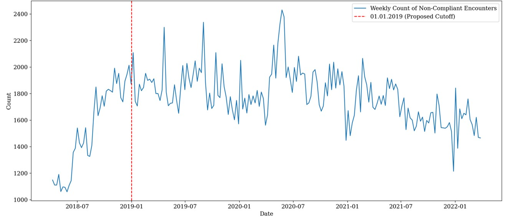

**Filtering:** Encounters where the officer is off duty or executing a custody duty were removed to focus on regular policing duties since decision-making patterns might differ substantially. By excluding instances with the escaped subject, it is possible to avoid potential biases or anomalies in situations where officers have not directly influenced the outcome. Observations where the use of force occurred in a police vehicle, custody, ambulances, or sports/events stadia were also removed to focus on the decision-making patterns in more typical policing scenarios.

### Data Management

The data management was implemented by developing a relational database powered by MySQL. The database was initially deployed on a local development computer and later migrated to Google Cloud to ensure scalability, accessibility, and reproducibility. 
- Data cleaning, pre-processing, and feature engineering were all done directly within MySQL during either data import or creation of database views. 
- The views were used instead of modifying the table itself, because it does not physically exist in the memory, and is only a virtual table that contains transformed data from one or more tables. 
- The pre-processing during the import involved mapping categorical fields to integers using custom mappings or one-hot encoding. 
- The filtering is applied to the views instead of removing observations. 
- The dictionary compression was also applied to reduce the redundancy and optimise the storage, ultimately allowing it to fit more than 2GB of raw data into 90MB of space. 
- The relationship constraints, check statements, and correct column data types were introduced to ensure database integrity by preventing inserts with invalid values. 
- To dynamically store the model's predictions for continuous evaluation, appropriate tables were created in the database and used within Python to upload or read the data. 

Figure. Relational database schema  
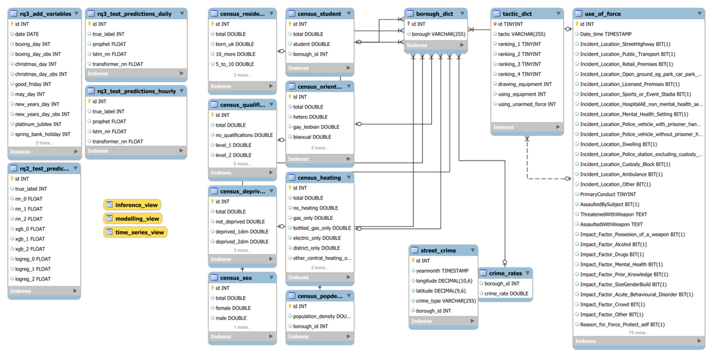  

It significantly simplified the analytics process since the TensorFlow and XGBoost computations were executed on the GPU-enabled cloud computing unit, with other less intensive tasks being executed locally. There are no considerations concerning data security since the used data is publicly available; however, if internal data is included, the appropriate steps should be implemented to ensure database security, e.g., encoding and network-level access restrictions.

## Inference Modelling

Although it was initially planned to use a multi-level linear regression to model the severity of a force used, it was later decided to **separate the problem into three multi-level logistic regression problems**, modelling whether a specific type of force was used, since factors could have varying statistical significance and magnitude of influence depending on the type of force is being and context. This approach provides deeper insights into patterns of force, which will be discussed in the following chapters.

The **three-level hierarchical logistic regression** models were fitted to investigate the first research question with encounters as first-level units. These are nested within the borough categories by their crime rate (high or low) and further nested within the officer group (armed or unarmed duty). This structure allows to account for potential differences in patterns by armed and unarmed duty officers in the neighbourhoods with lower or higher crime rates.

Figure. Hierarchical structure (models 1 and 2)  
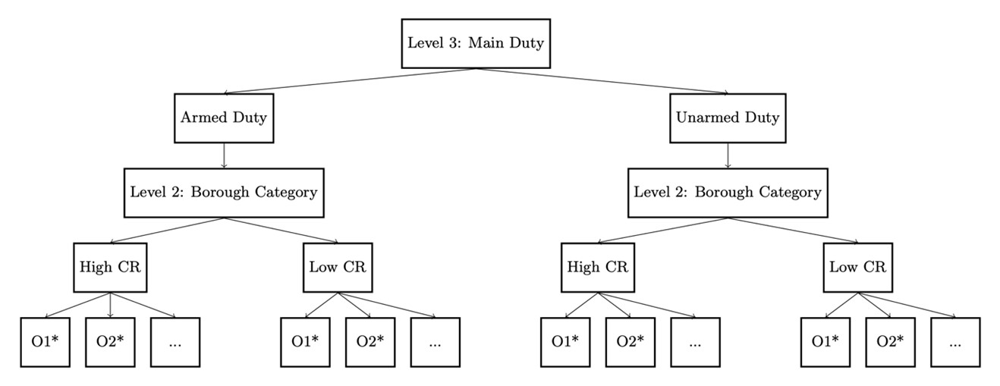

Nevertheless, for model that analyses the probability of using a weapon once it is drawn, **this structure is not suitable** since grouping by duty is causing singularity, allegedly due to the quasicomplete separation problem that prevents maximisation of log-likelihood. The reason is the insufficient sample size caused by limiting the scope to the encounters with the weapon drawn, which is an inherently rare occurrence in British policing; therefore, an approach is prone to singularity because certain variables can perfectly separate the data by chance.

Figure. Hierarchical structure (model 3)  
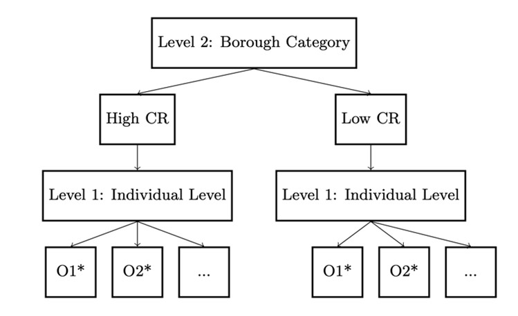

Unlike the basic regression models, where variables could be selected through automated variable selection, the multi-level models require significantly longer computation times; therefore, the **'block' variable selection** is used by partitioning the predictors into six blocks, which are then used in the manual variable selection. 

### Model 1

The first model limits the scope to the cases where any weapon is neither drawn nor used, comparing cases of unarmed force (pressure points, strikes, restraints, take-downs) versus no physical force (communications or/and compliant handcuffing).

Figure. Model 1 equation  
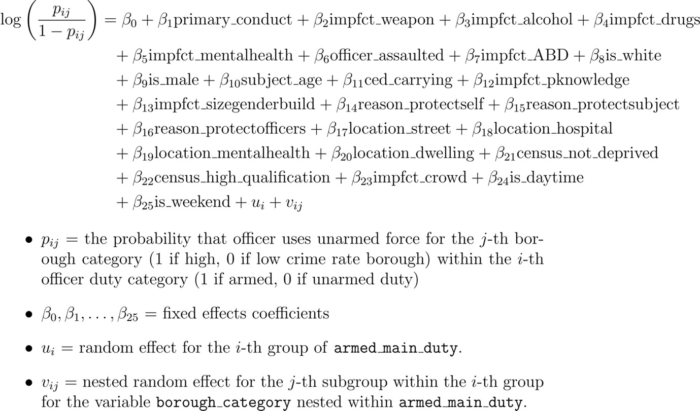

### Model 2

The second model excludes the cases where weapons are used and models the probability of an officer drawing a weapon (irritant sprays, CED, police dog, baton, AEP or a firearm).

Figure. Model 2 equation  
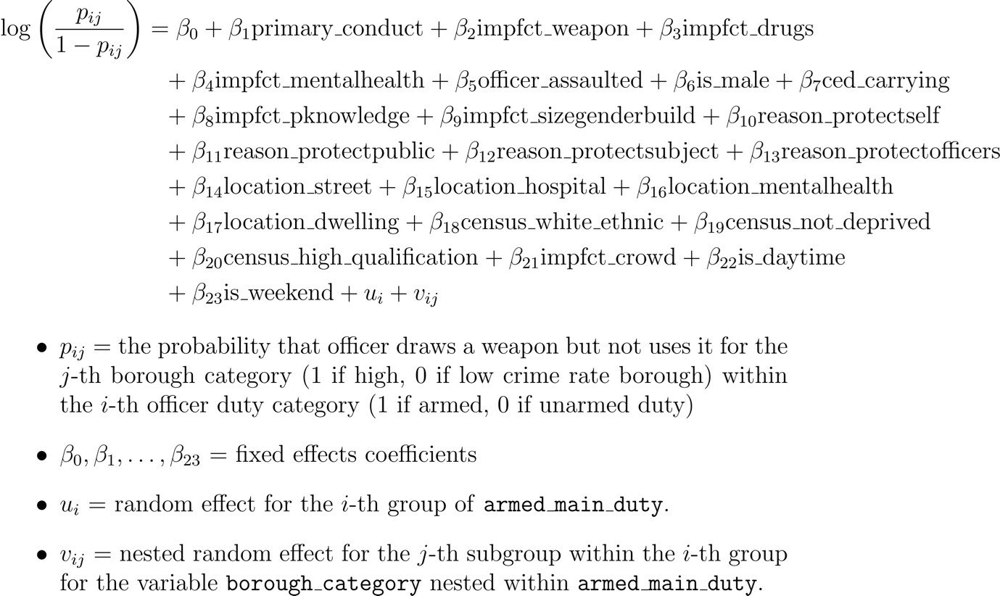

### Model 3

The third model limits the analysis to the cases where the officer draws a weapon to evaluate the factors influencing the decision to use this weapon.

Figure. Model 3 equation  
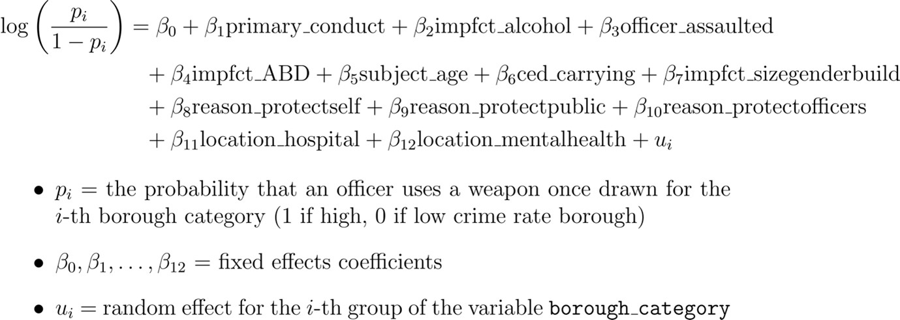

## Predictive modelling

Based on the inferential multivariate analysis conducted to answer the first research question, the subject's primary conduct was identified as a significant predictor for the use of police force. 

The problem was formulated as a multi-class classification task, separating the subjects into three classes: compliant, passive/verbal resistant and active/aggressive resistant.

Figure. Primary conduct classifier model input summary  
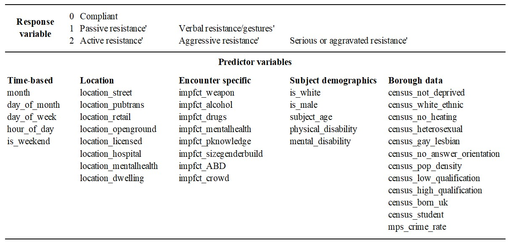

Three machine learning algorithms were chosen to address this problem: 
- Extreme Gradient Boosting (XGBoost)
- Feedforward Neural Network (using a softmax activation function as an output layer)
- Elastic Net Regularized Logistic Regression

The under-sampling of a majority class was used to balance the training data.

## Time-series modelling

Capturing temporal dependencies and trends using time-series analysis is central to the investigation of a third research question.

Encounters with compliant subjects do not pose a significant threat; therefore, they were excluded from the time-series to focus on encounters in which the subject shows resistance. Unfortunately, it decreased the predictability of the time-series since the autocorrelation plots indicate weaker correlations of observations with its lags (observations shifted by n steps back in time); nevertheless, it is reasonable to accept this decrease in favour of improved model’s practicality.

Figure. ACF and PACF plots of time series (excluding compliant encounters) 
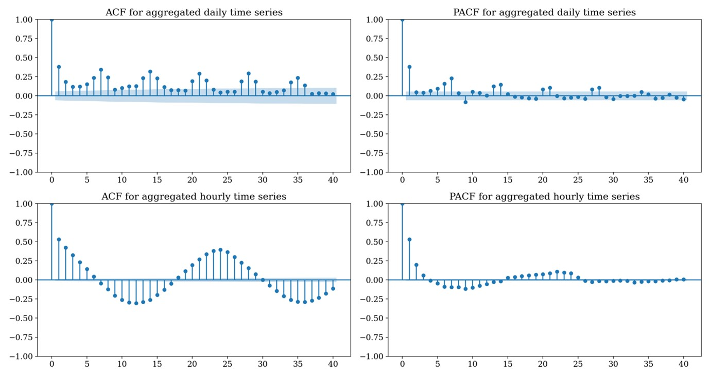

The exact coordinates for each encounter are not available within this dataset, therefore, it is not feasible to map the observations to a custom grid and perform spatio-temporal anylysis; however, it is possible to implement an approach on a higher level, treating boroughs as spatial cells. An attempt failed since the time-series becomes unpredictable once disaggregated to a borough level.

Figure. Example of ACF and PACF plots for Lambeth borough  
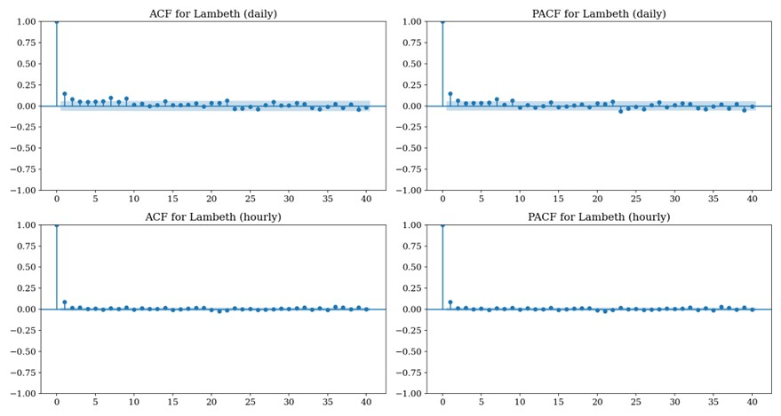

### 1. Prophet

The first selected model, **Prophet**, was initially developed and actively used in Facebook. It is fundamentally a decomposable regression model with intuitively adjustable interpretable parameters, which is similar to generalized additive model (GAM) specification and can be summarised in the following equation:

Figure. Decomposable time-series model in Prophet (Equation)  
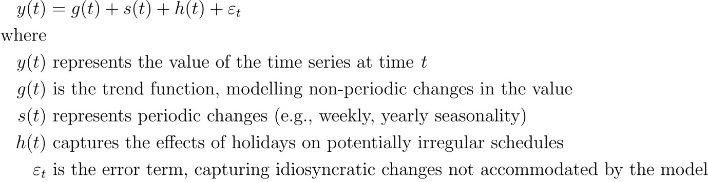

Prophet's primary advantages over other models are flexibility in dealing with seasonality and missing data without interpolation, absence of stationarity requirement, fast and computationally inexpensive fitting, the ability to manually specify the trend changepoints where the growth rate is allowed to change (e.g., future product launches), and ability to set the domain-specific boundaries.

### 2. Long short-term memory (LSTM) recurrent neural network (RNN)

The second chosen model is a **recurrent neural network (RNN) type that utilizes long short-term memory (LSTM) cells**. In comparison with training a traditional neural network on time-series data, where the whole sequence would be fed into a model at once (the approach ignores the temporal dependencies in a sequence), the RNN is designed to process the sequential data more efficiently by feeding elements one at a time, each time considering the output from the previous time points. Nevertheless, the basic RNN is prone to the problem of vanishing gradient when the sequence becomes lengthier since the term descends to zero exponentially fast, which makes learning long-term dependencies difficult to learn. The main benefit of applying this model over Prophet is that it can learn complex non-linear patterns but at the cost of being highly computationally expensive and not interpretable.

Figure. Illustration of LSTM  
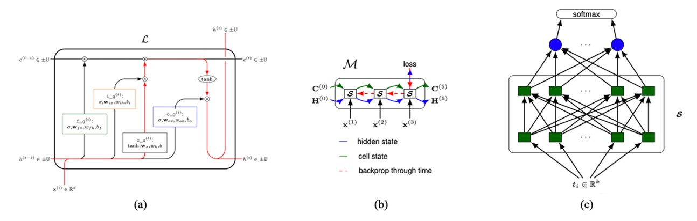 
(a) A single LSTM cell. (b) Training procedure for LSTM network. (c) Example of a network configuration based on LSTM.

### 3. Transformer-encoded NN

LSTM has been a state-of-art approach and was commonly applied to numerous sequence modelling tasks, including time-series prediction; however, in 2017, the researchers at Google proposed a novel architecture called 'Transformer', which is based on attention mechanisms that do not rely on recurrence and show a superior performance while taking significantly less time to train by being more 'parallelizable'. Due to its ability to process the whole sequence simultaneously by utilizing a multi-head self-attention mechanism, this architecture allows a model to learn global patterns through the attention mechanism and local patterns through the feedforward network.

Figure 13. Transformer architecture 
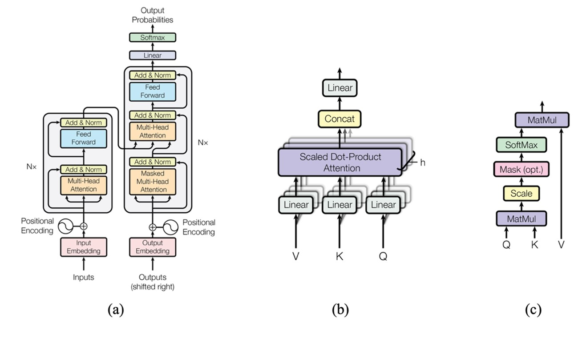 
(a) Transformer NN architecture. (b) Multi-head Attention block. (c) Scaled Dot-Product attention block within (b).

Although the Transformer architecture has numerous benefits over RNN, the major drawback of this architecture is that scaling attention to extremely long sequences is computationally prohibitive since the space complexity of self-attention grows quadratically with sequence length. This becomes a serious issue in forecasting time series with fine granularity and strong long-term dependencies.

## Findings and Discussion

### 1. Inference modelling

Below is the shortened summary table for all three final models. The final models have pseudo-R2 values considered substantial in behavioural sciences.

Figure. Modelling summary table  
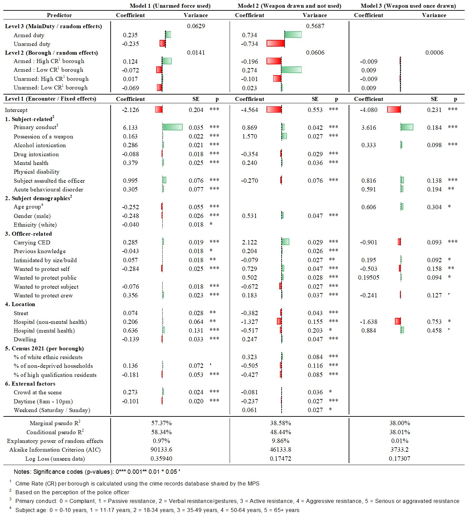

The **subject-related encounter-specific variables** provide the most explanatory power in using unarmed and armed force, with relatively low additional pseudo-R2 added by introducing new blocks of variables in those models. 
- An increase in the subject's primary conduct significantly increases the likelihood of using unarmed and armed force while being relatively less important but significant to the likelihood of drawing a weapon. 
- Subject possessing a weapon, even if not necessarily threatening, raises the odds of police using an unarmed force or drawing a weapon but not significant for using a weapon once drawn. 
- The subject assaulting the officer dramatically increases the probability of using armed and unarmed force while decreasing the probability of drawing a weapon and not using it. 
- The significant relationships for the subject's physical disability were not observed, while drug intoxication, counterintuitively, is lowering the likelihood of using unarmed force or drawing a weapon, allegedly because subjects under certain drugs or having physical disabilities tend to be less confrontational, but further investigation is required. 
- Alcohol intoxication, on the other hand, increases the probability of both types of force being used; however, no relationship with the weapon being drawn is found. 
- The encounters involving subjects with mental health issues have higher chances of using unarmed force or drawing a weapon, but no relationship with using a weapon was found. 
- Acute behavioural disorder (ABD), an aggressive case of mental illness, is associated with an increased probability of using unarmed or armed force; however, there is no relationship with drawing a weapon and not using it. 

In general, the significance of this group of factors is consistent across three types of force.

---

**Subject demographics** only show a substantial relationship with using unarmed force, with questionable significance of an ethnic group. 
- Males and younger subjects have slightly higher odds of experiencing unarmed force or the weapon being drawn. Although the armed force model indicates increased odds for older people, it should be considered cautiously because of the coefficient's low significance. 

Subject demographics are shown to contribute only a minor share of explanatory power to the final models, indicating that the bias, if present, is insignificant. 

---

The **perception of the situation by the officer** plays a considerable role in determining the probability of an officer drawing a weapon without using it, contributing to a significant increase in the pseudo-R2. 
- There is a correlation between prior knowledge about the subject and higher chances of drawing a weapon but lower chances of using unarmed force. 
- Interestingly, officers were likelier to use unarmed force when intimidated by the subject's physique. 
- In contrast, the desire to defend themselves was associated with less probability of using unarmed force but instead drawing a weapon. 
- The odds of the officer drawing a weapon were also strongly connected with their desire to defend their crew or the public. 
- However, there were fewer odds of the officer drawing a weapon but higher odds of using unarmed force when the officer wanted to protect the subject.

--- 

The **location of the encounter** is related to the probability of using unarmed force or drawing a weapon; however, there is not enough evidence to suggest that it is associated with a decision to use a weapon once drawn. 
- Officers are more likely to use unarmed force in a street and hospital setting but less likely in a dwelling. 
- The situation is inverse for drawing a weapon and not using it; police are less likely to do it on a street or in a hospital setting, while more likely to if an encounter occurs in a dwelling. 
- The influence of borough demographics on the encounter was only shown to be substantial for drawing a weapon without usage, allegedly because officers tend to be more cautious in less developed areas of London. 
- Only the percentage of highly educated residents in the area was inversely related to the odds of resorting to using unarmed force.

---

**External factors** only account for a minor explanatory power, with the crowd increasing the probability of using armed force and increased probability of using armed force or drawing a weapon at night-time.

---

The **random effects** introduced by the hierarchical structure provide the most explanatory power for modelling the odds of a weapon being drawn and not used, while providing moderate power in the model for unarmed force and low power to the model for using the weapon once drawn. 
- Armed response officers are more likely to resort to unarmed force or draw a weapon (note that the term ‘weapon’ includes all types of equipment, including those available to 'unarmed' duties). 
- Both armed and unarmed duty members are more likely to use unarmed force but less likely to draw a weapon without using it in high crime rate boroughs.

### 2. Predictive modelling

The performance analysis of predictive models for primary conduct shows strengths and weaknesses across different metrics while being similar to each other in general. The neural network has slightly better overall accuracy than other models, with the XGBoost model following closely. Logistic regression excels at capturing trends behind the passive/verbal resistance but is worse at predicting compliant and aggressive conduct. While the models perform better than random guesses for predicting aggressive resistance or compliance, the quality of those predictions is far from perfect, making them unreliable for real-world applications.

The insufficient predictive performance of the primary conduct models using foreknowledge could be explained by the fact that it is primarily influenced by how the interaction plays out. The past research by [Mazerolle et al. (2013)](https://doi.org/10.1007/s11292-013-9175-2) supports this hypothesis by outlining those encounters involving officers using the principles of procedural justice dialogue by demonstrating dignity and respect, positively contributing to the quality of an encounter, making subjects more satisfied in general and less likely to resist. Nevertheless, the complexity and unpredictability of human behaviour play a significant role, suggesting that sometimes the reasons for citizen primary conduct do not depend on the quality of the communication.

Figure. Multi-class classifier performance comparison 
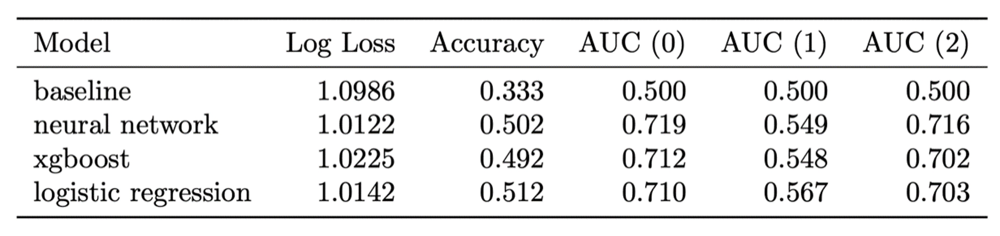 
Figure. ROC curves  
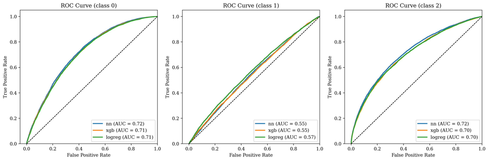 
Figure. Classification reports  
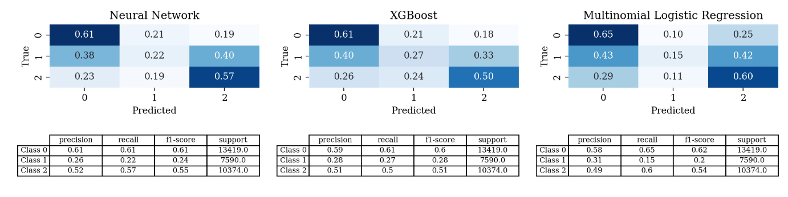 

Mental health issues and alcohol intoxication are among the most critical foreknowledge drivers of aggressive primary conduct, while older subjects and males are less likely to behave aggressively during the encounter.

Figure. Feature importance and regression coefficients 
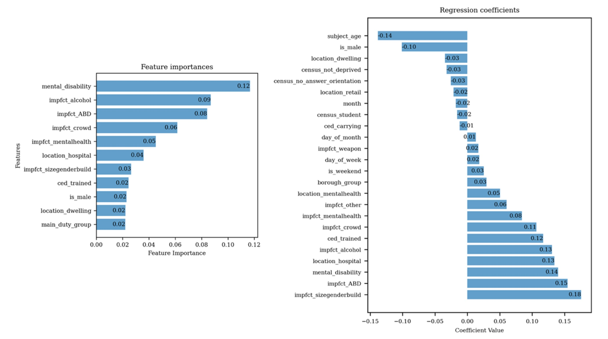 

### 3. Time series modelling

The strong seasonality on a daily and weekly level was discovered while investigating the temporal trends for non-compliant encounters. During the workdays, there were fewer such encounters, with the least amount happening on Monday, mainly in the middle of the day. On weekends, the peaks were shifted towards the night-time, with more encounters happening. Nevertheless, this interpretation does not imply that people tend to be more aggressive at certain times since there is insufficient evidence to suggest it.	

Figure. Heatmap of the non-compliant encounters  
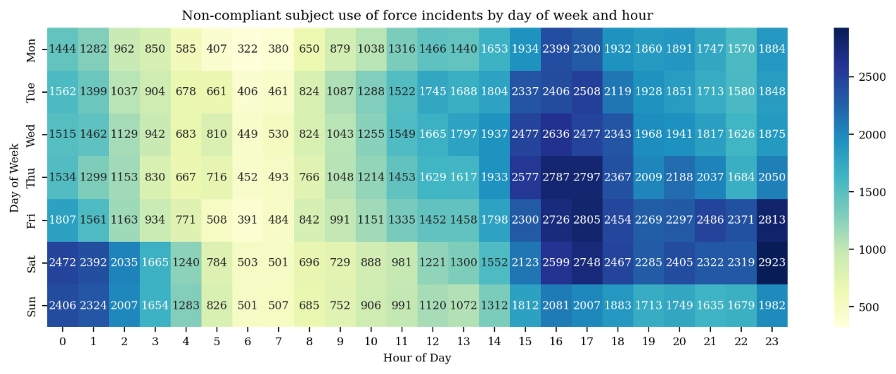 

Figures. Seasonal components from the Prophet (hourly and daily) 
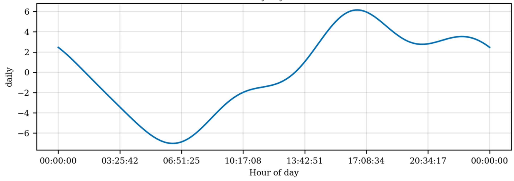 
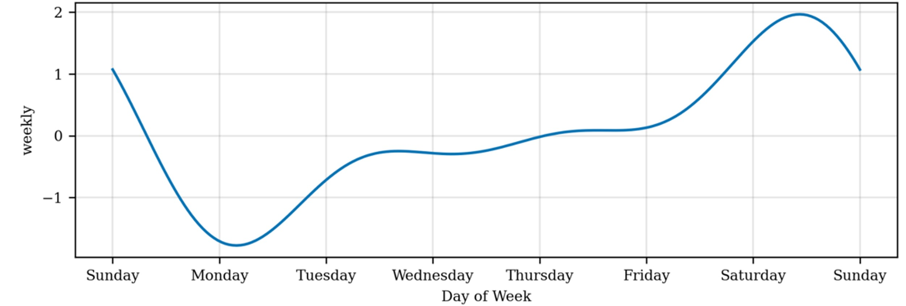 

The time-series decomposition of a Prophet model suggests that there was an impact of a COVID-19 pandemic that influenced the trend, with changepoints and outliers situated around the period of lockdown measures; however, after 2021, the trend demonstrated a consistent decline. The police enforcing the lockdown measures might be the reason behind the spike in non-compliant encounters.

Figure. Trend component (Prophet)  
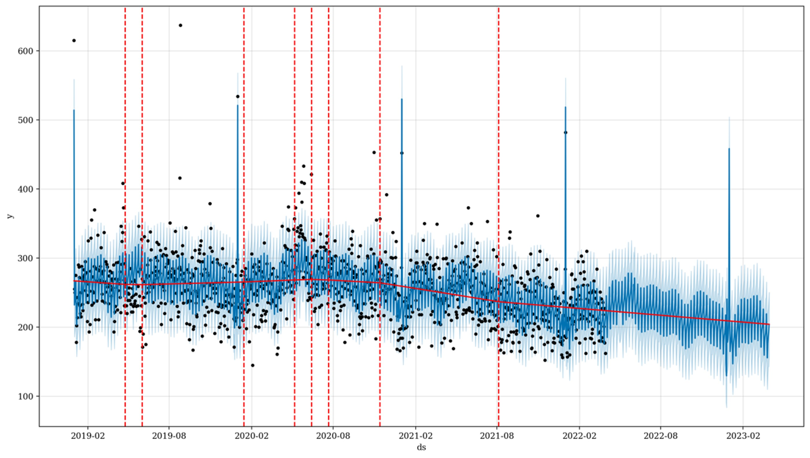 

Additionally, the recurring UK holidays are significantly related to the rates of non-compliant encounters. New Year's Day is the holiday causing the most significant spike among other holidays. While Boxing Day and Christmas Day are associated with a decrease in such encounters, the data indicates an increasing effect when they are observed on a date different from its traditional calendar date. Other public holidays, including Good Friday, May Day, and Spring Bank Holiday, also increase the rate, which has a small but statistically significant impact.

Figure. Recurring holidays effect (Prophet)   
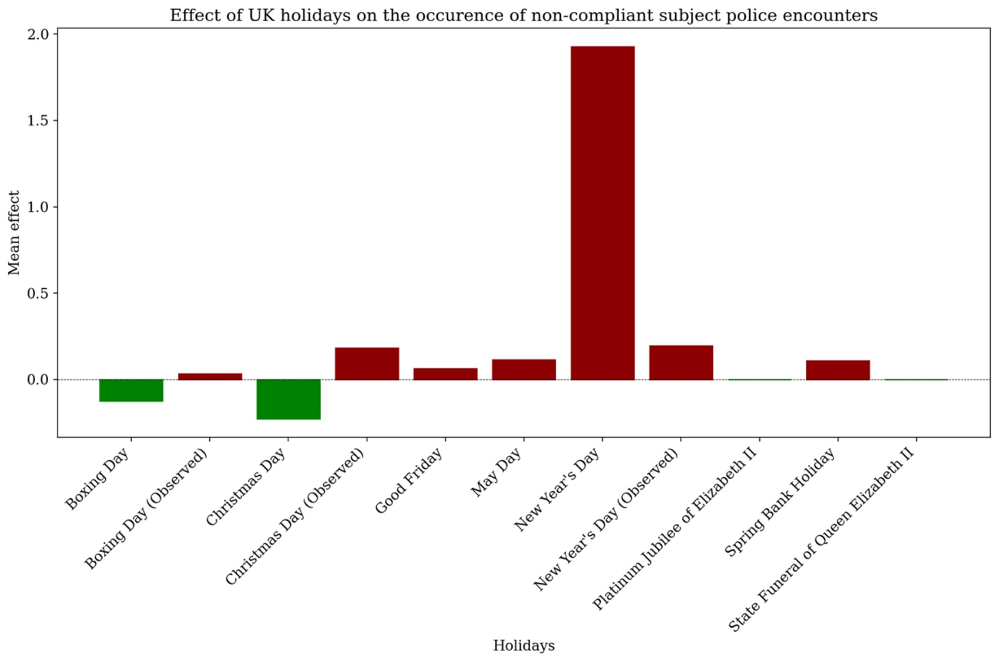 

The time-series proved to be predictable to a certain extent, but there is still a significant proportion of noise due to the fundamental complexity of the phenomena. According to the Ljung-Box tests, all the models fail to effectively capture the underlying trend at the daily level, most likely because non-recurring events and other factors could further explain the deviations. Nevertheless, on the hourly level, the models can explain more variation, suggesting that achieving a decent predictive accuracy is feasible without introducing additional variables if predictions are made in the next 24 hours. Notably, the transformer model achieves superior performance on a daily level while being the worst model at the hourly level, highlighting the consequences of an inability to accommodate a longer sequence length within available VRAM (only 8GB was available at the time).

Figure. Ljung-Box test for autocorrelation in residuals    
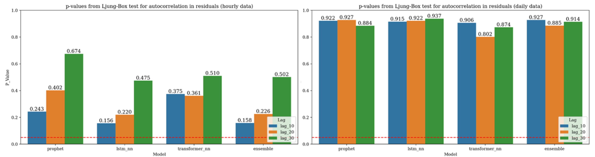 
Figures. Actual vs predicted values for the unseen data (hourly and daily)   
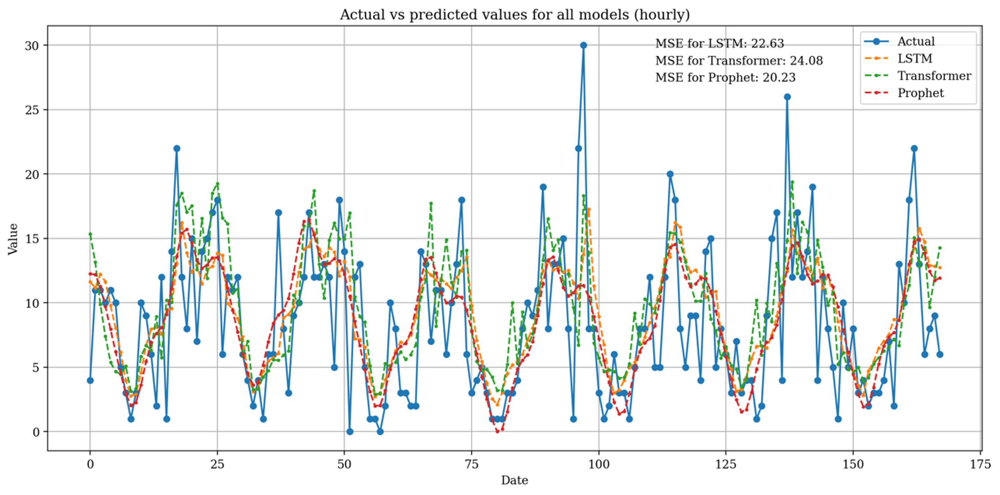 
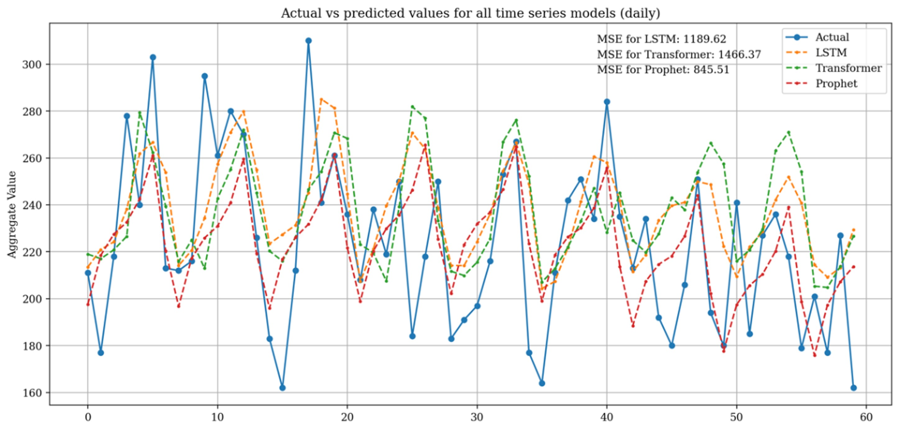 

## Limitations and recommendations for future research

Policymakers in the MPS could benefit by the findings from the study taken into consideration when shaping the related policies, by building them on an up-to date evidence-led analysis of officer's decision-making to minimize the criticism while maintaining society's safety.

The main limitation of this study is that methods used to derive insights are designed to identify associations rather than causal relationships, and the results of this research should be taken as a suggestion of potential relationships but not as evidence of causality. Further research using primary data is needed to prove the findings and provide deeper insights into police officer decision-making patterns, particularly regarding the influence of the subject's drug intoxication and mental health.

In future studies addressing similar research topics, it is recommended to include the event data close to the time and place of the encounters since it might provide a more nuanced understanding of the patterns underlying the likelihood of various forms of force being used and enhance the predictability of primary conduct and the rates of non-compliant encounters. Such data could be extracted from social media platforms (e.g., Facebook or Twitter). 

The current inference-focused models aggregate all weapon types (from incapacitating sprays to firearms) into "weapon used" or "weapon drawn" categories, while future studies should break down these categories given the likely diverse patterns underlying the deployment of each weapon type. Moreover, they should attempt to examine the interaction effects rather than analysing components in isolation. To concentrate on typical policing contexts, some scenarios involving the use of force in police vehicles, detention facilities, ambulances, or sports/events stadiums were left out of this study, while separately exploring the decision-making processes in these excluded situations may be helpful in future studies.

The predictive power for primary conduct modelling is seriously constrained by the inability to account for encounter dynamics, depending purely on foreknowledge, despite neural networks achieving a moderate performance in differentiating compliant and aggressively resistive behaviour with some advantage over other models. Therefore, it is advised against using these models to forecast the subject's behaviour during interactions in the real world. 

The LSTM model shows a decent performance and is better than others at capturing underlying trends at an hourly level. While all the models showed limited predictability on a daily level, the predictions within a 24-hour window are more reliable. Given hardware constraints that limited the Transformer architecture to only 720 hours of prior data, future research should examine extending sequence length using more capable GPUs and investigate incorporating event-related information to explain outliers. Future research may also frame the task as a classification by computing a moving average and determining whether observations fall above or below this benchmark, which can increase the performance without sacrificing practicality.
